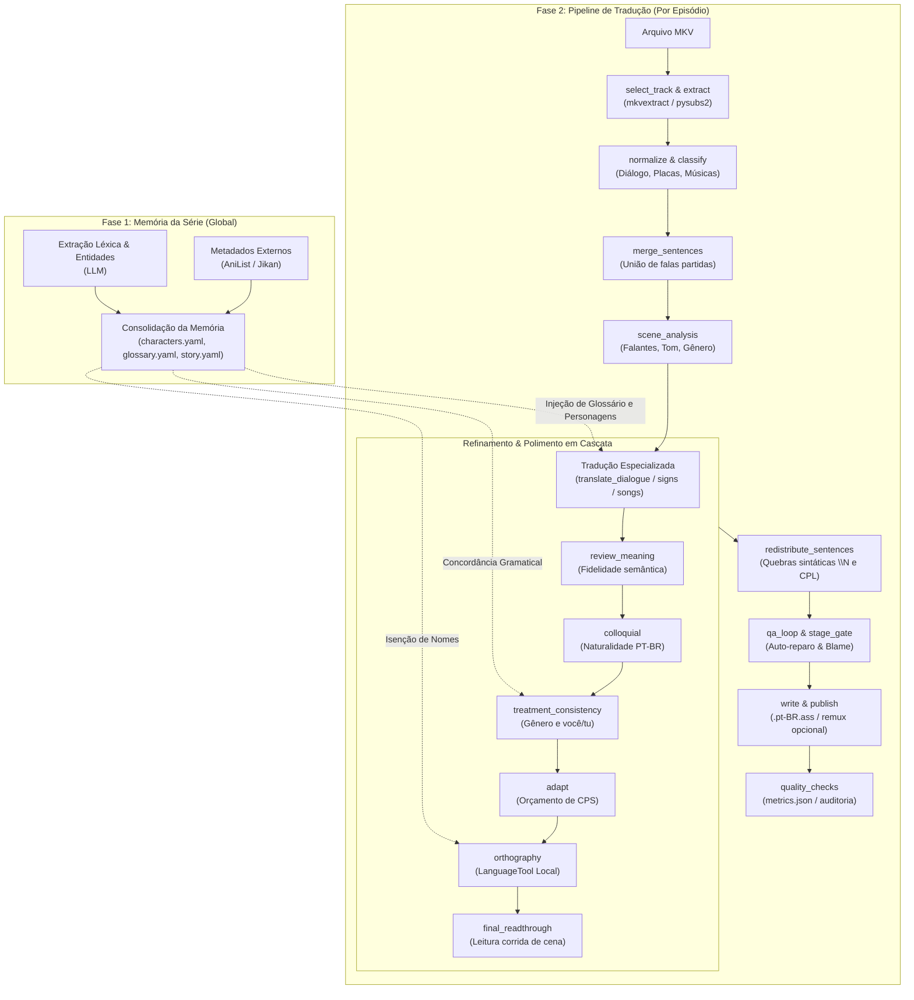

<!-- Optional: add a project banner at docs/assets/banner.png -->

<h1 align="center">TranslaterAny</h1>

<p align="center">
  <strong>Pipeline determinístico de tradução e engenharia de legendas de anime (EN → PT-BR) com inteligência artificial local-first.</strong>
</p>

<p align="center">
  
  
  
  
  
  
  
</p>

<p align="center">
  <a href="#-sobre">Sobre</a> •
  <a href="#-destaques">Destaques</a> •
  <a href="#-arquitetura">Arquitetura</a> •
  <a href="#-tech-stack">Tech Stack</a> •
  <a href="#-pré-requisitos">Pré-requisitos</a> •
  <a href="#-instalação--início-rápido">Instalação</a> •
  <a href="#-comandos-cli">Comandos CLI</a> •
  <a href="#-configuração">Configuração</a> •
  <a href="#-testes">Testes</a> •
  <a href="#-roadmap">Roadmap</a>
</p>

---

## 📖 Sobre

O **TranslaterAny** é uma ferramenta de automação e engenharia de legendas desenvolvida para traduzir acervos de animes em formato MKV do inglês (**EN**) para português brasileiro (**PT-BR**), mantendo a fidelidade técnica e estética digna dos melhores *fansubs*.

Diferente de abordagens ingênuas que submetem arquivos inteiros de legenda a modelos de linguagem — destruindo marcações de tempo, tags ASS e consistência de personagens —, o TranslaterAny decompõe o processo em duas fases determinísticas:

1. **Memória da Série (Global):** constrói uma base de conhecimento duradoura consultando metadados canônicos no [AniList](https://anilist.co) e no [Jikan](https://jikan.moe) (MyAnimeList), complementada por extração léxica de termos, entidades e fichas de personagens persistidas em arquivos YAML editáveis.
2. **Pipeline em 26 Estágios (Por Episódio):** processa as unidades de fala em etapas isoladas com responsabilidade única — cobrindo desde desmembramento/fusão de frases partidas até tradução contextual, refinamento semântico, uniformidade de pronomes/gênero, orçamento de caracteres, blindagem ortográfica local e um laço de controle de qualidade com auto-reparo e rastreamento retroativo de defeitos (*blame*).

O ecossistema é **local-first** por padrão: executa em hardware doméstico via [Ollama](https://ollama.ai) e microserviço containerizado do [LanguageTool](https://languagetool.org), assegurando custo zero de API e privacidade total.

---

## 🌟 Destaques

- 🔒 **Local-First & Custo Zero**: Opera offline via Ollama com modelos especializados (`translategemma:12b` para tradução direta e `gemma4:12b` para análise de cena, refinamento e QA). Suporte opcional a nuvem (OpenAI / Gemini).
- 🧠 **Memória Canônica da Série**: Metadados externos combinados com extração de termos e entidades. Mantém glossário persistido em YAML (`characters.yaml`, `glossary.yaml`, `story.yaml`) editável pelo usuário.
- 🎭 **Resolução de Gênero e Tratamento**: Tratamento consistente de pronomes (*você / tu / senhor*) e concordância gramatical de cargos e substantivos (*a presidente / o servo*) guiada pelos gêneros catalogados dos personagens.
- ⏱️ **Controle Rígido de Legibilidade (Padrão Netflix PT-BR)**: Orçamento dinâmico de caracteres por tempo de tela ($\le 17$ CPS, $\le 42$ CPL e máximo de 2 linhas), com quebras sintáticas inteligentes (`\N`) e condensação de fala sem perda de sentido.
- 🛡️ **Blindagem Ortográfica Determinística**: LanguageTool local com isenção automática de nomes próprios japoneses, entidades da série e termos técnicos.
- 🔄 **StageGates & QA Loop com Blame**: Portões de qualidade entre etapas que impedem a propagação de falhas, revertem alterações prejudiciais e realizam auto-reparo em laço com diagnóstico da etapa causadora.
- 🎨 **Preservação Integral de ASS**: Extração e regravação segura preservando tags avançadas de estilização, posicionamento, romaji e fontes customizadas. Remux opcional no arquivo MKV original.

---

## 🏗️ Arquitetura

O processamento é dividido entre o conhecimento da série e o pipeline de execução:



### Relação dos 26 Estágios do Pipeline

| # | Estágio | Escopo | Finalidade Principal |
|---|---|---|---|
| 1 | `inventory` | Série | Varredura de episódios e validação de arquivos na biblioteca |
| 2 | `metadata` | Série | Obtenção de metadados canônicos via AniList e Jikan |
| 3 | `select_track` | Episódio | Seleção heurística da melhor faixa de legenda em inglês (Full/Dialogue) |
| 4 | `extract` | Episódio | Extração da faixa ASS selecionada via `mkvextract` |
| 5 | `normalize` | Episódio | Padronização de codificação de texto (UTF-8) e estilos |
| 6 | `classify` | Episódio | Classificação de linhas: diálogo, placas (*signs*) ou músicas (*songs*) |
| 7 | `extract_terms` | Episódio | Extração de nomes de personagens e termos desconhecidos via LLM |
| 8 | `consolidate_memory` | Série | Consolidação e persistência dos arquivos de memória da série |
| 9 | `translation_memory` | Série | Aplicação e consulta à memória de tradução acumulada |
| 10 | `merge_sentences` | Episódio | Fusão de frases partidas em eventos adjacentes |
| 11 | `scene_analysis` | Episódio | Identificação de falantes, gênero gramatical e contexto da cena |
| 12 | `translate_dialogue` | Episódio | Tradução contextual de falas com TranslateGemma |
| 13 | `translate_signs` | Episódio | Tradução de placas e textos visuais mantendo formatação |
| 14 | `translate_songs` | Episódio | Tradução de canções (pulada por padrão; preserva romaji/karaokê) |
| 15 | `review_meaning` | Episódio | Revisão estrita de fidelidade semântica contra o texto original |
| 16 | `colloquial` | Episódio | Adaptação para português coloquial e fluidez natural |
| 17 | `treatment_consistency` | Episódio | Harmonização de pronomes de tratamento e artigos de gênero |
| 18 | `adapt` | Episódio | Condensação de falas para respeitar o orçamento de CPS |
| 19 | `orthography` | Episódio | Checagem gramatical e ortográfica no LanguageTool com isenções |
| 20 | `final_readthrough` | Episódio | Leitura corrida em português do bloco da cena para coesão |
| 21 | `redistribute_sentences` | Episódio | Quebra sintática de linhas (`\N`) e respeito ao limite de CPL |
| 22 | `qa_loop` | Episódio | Auditoria final, detecção de regressões, auto-reparo e *blame* |
| 23 | `write` | Episódio | Montagem e regravação do arquivo `.pt-BR.ass` com eventos preservados |
| 24 | `publish` | Episódio | Publicação do arquivo final no diretório da série |
| 25 | `remux` | Episódio | Remux da legenda no MKV original (desabilitado por padrão) |
| 26 | `quality_checks` | Episódio | Auditoria de conformidade técnica e geração do `metrics.json` |

---

## 💻 Tech Stack

| Camada | Tecnologia | Utilização no Projeto |
|---|---|---|
| **Linguagem & Runtime** | Python 3.14+ | Core da aplicação com suporte a novos recursos da linguagem |
| **Gerenciador de Pacote** | Astral [`uv`](https://github.com/astral-sh/uv) | Resolução ultra-rápida de dependências e ambientes virtuais |
| **CLI & Terminal** | Typer & Rich | Interface de linha de comando com tabelas, barras de progresso e cores |
| **Orquestração de IA** | `pydantic-ai-slim` + Ollama Native | Execução estruturada com validação de esquema e retry |
| **Modelos Recomendados** | `translategemma:12b` & `gemma4:12b` | Modelos locais para tradução direta e refinamento analítico |
| **Manipulação de Mídia** | MKVToolNix & `pysubs2` | Extração, inspeção de faixas e regravação de arquivos ASS/MKV |
| **Ortografia & Gramática**| LanguageTool (Docker) | Servidor HTTP local para validação sintática e gramatical |
| **Metadados** | AniList (GraphQL) & Jikan (REST) | Obtenção de sinopses, personagens, papéis e dados de produção |
| **Tipografia & Fontes** | FontTools | Validação de cobertura de glifos das fontes embutidas na legenda |
| **Validação & Resiliência**| Pydantic v2 & Tenacity | Esquemas estritos de dados e políticas de tentativas exponenciais |
| **Testes & Qualidade** | Pytest & Ruff | Suíte com 659 testes automatizados e linter moderno |

---

## 📋 Pré-requisitos

1. **Python 3.14+** gerenciado via [`uv`](https://github.com/astral-sh/uv)
2. **MKVToolNix** (`mkvmerge` e `mkvextract`) disponível no `PATH`:
   ```bash
   # Debian / Ubuntu
   sudo apt install mkvtoolnix

   # Arch Linux
   sudo pacman -S mkvtoolnix-cli

   # Fedora
   sudo dnf install mkvtoolnix
   ```
3. **Docker & Docker Compose** (para executar o LanguageTool local)
4. **Ollama** configurado com os modelos locais recomendados:
   ```bash
   ollama pull translategemma:12b
   ollama pull gemma4:12b
   ```

---

## 🚀 Instalação & Início Rápido

### 1. Clonar o Repositório e Sincronizar Dependências

```bash
git clone https://github.com/FM0Ura/TranslaterAny.git
cd TranslaterAny

# Sincroniza o ambiente com uv
uv sync
```

### 2. Iniciar o Microserviço do LanguageTool

O projeto inclui um `docker-compose.yml` pré-configurado utilizando a imagem otimizada `meyay/languagetool:latest`:

```bash
# Iniciar o container na porta local 8010
docker compose up -d

# Verificar se o serviço está ativo
docker compose ps
```

### 3. Diagnóstico do Ambiente (`doctor`)

Execute o comando `doctor` para validar se ferramentas, portas, conectividade de APIs e modelos locais estão prontos:

```bash
uv run translaterany doctor
```

Saída esperada:
```text
✅ python         Python 3.14.x
✅ data_dir       diretório acessível (~/.local/share/translaterany)
✅ mkvmerge       mkvmerge v... presente no sistema
✅ mkvextract     mkvextract v... presente no sistema
✅ languagetool   LanguageTool acessível em http://localhost:8010/v2/check
✅ gpu            NVIDIA GeForce RTX ... detectada
✅ ollama         Ollama ativo (http://localhost:11434)
✅ models         translategemma:12b e gemma4:12b disponíveis
```

---

## ⚡ Comandos CLI

A CLI do TranslaterAny fornece ferramentas completas para execução, estimativa, depuração e governança de dados:

```bash
uv run translaterany [COMANDO] [OPÇÕES]
```

### 1. `run` — Processar Série ou Biblioteca

Executa o pipeline completo na pasta indicada. Pode apontar para uma série individual ou para uma pasta contendo múltiplas séries:

```bash
# Processar uma série específica
uv run translaterany run "/caminho/para/Animes/Nome da Serie (2024)"

# Forçar reprocessamento de episódios pulados e sobrescrever legendas existentes
uv run translaterany run "/caminho/para/Animes/Nome da Serie (2024)" --force

# Executar com logs detalhados
uv run translaterany --verbose run "/caminho/para/Animes/Nome da Serie (2024)"
```

### 2. `estimate` — Estatísticas e Estimativa de Custos

Calcula o número de episódios, eventos de fala, volume estimado de tokens de entrada/saída e tempo previsto de processamento sem disparar chamadas pesadas:

```bash
uv run translaterany estimate "/caminho/para/Animes/Nome da Serie (2024)"
```

### 3. `status` — Acompanhar Progresso da Série

Exibe uma visão consolidada de cada episódio da série, incluindo estado atual (`ok`, `skipped`, `failed`), última etapa concluída e faixa de legenda selecionada:

```bash
# Consultar o status de uma série
uv run translaterany status "/caminho/para/Animes/Nome da Serie (2024)"

# Listar todas as séries já processadas no banco local
uv run translaterany status
```

### 4. `retry` — Reprocessamento Inteligente

Permite reabrir episódios a partir de uma etapa específica do pipeline ou reprocessar apenas o que foi afetado por atualizações no glossário:

```bash
# Reprocessar a série a partir da etapa de consistência de tratamento
uv run translaterany retry "/caminho/para/Serie" --from treatment_consistency

# Reprocessar apenas o episódio S01E03 a partir da revisão semântica
uv run translaterany retry "/caminho/para/Serie" --from review_meaning --episode S01E03

# Reabrir episódios com termos desatualizados após edição manual do glossário
uv run translaterany retry "/caminho/para/Serie" --stale
```

> [!NOTE]
> Após utilizar o `retry`, execute novamente `uv run translaterany run "/caminho/para/Serie"` para processar as etapas reabertas.

### 5. `report` — Métricas de Processo, Qualidade e Blame

Apresenta tabelas detalhadas de tempo por etapa, consumo de tokens por modelo, indicadores de velocidade de leitura (CPS/CPL), falhas por checagem e o relatório de auditoria do QA Loop:

```bash
# Exibir relatório consolidado da série
uv run translaterany report "/caminho/para/Serie"

# Filtrar o relatório para um único episódio
uv run translaterany report "/caminho/para/Serie" --episode S01E01

# Exportar as métricas em formato JSON (linha de base)
uv run translaterany report "/caminho/para/Serie" --json docs/baselines/minha-linha-base.json

# Comparar a execução atual com uma linha de base salva anteriormente
uv run translaterany report "/caminho/para/Serie" --baseline docs/baselines/minha-linha-base.json
```

### 6. `memory` — Inspeção e Governança da Memória da Série

Gerencia o glossário, fichas de personagens e sinopse da série armazenados em arquivos YAML:

```bash
# Visualizar tabelas de personagens e glossário persistidos
uv run translaterany memory "/caminho/para/Serie"

# Forçar atualização de metadados no AniList/Jikan e limpar cache local
uv run translaterany memory "/caminho/para/Serie" --refresh

# Exportar os arquivos YAML (characters.yaml, glossary.yaml, story.yaml)
uv run translaterany memory "/caminho/para/Serie" --export ./backup-memoria/

# Importar correções ou termos customizados de volta para a série
uv run translaterany memory "/caminho/para/Serie" --import ./backup-memoria/
```

---

## ⚙️ Configuração

### Hierarquia de Configuração

O TranslaterAny carrega sua configuração na seguinte ordem de precedência:
1. Argumento explícito `--config <caminho>`
2. Variável de ambiente `TRANSLATERANY_CONFIG`
3. Arquivo padrão em `~/.config/translaterany/config.toml` (ou `$XDG_CONFIG_HOME/translaterany/config.toml`)
4. Padrões embutidos no código

### Exemplo de `config.toml`

<details>
<summary>Clique para visualizar o arquivo <code>config.toml</code> completo</summary>

```toml
[general]
log_level = "INFO"
# data_dir = "~/.local/share/translaterany"  # Opcional (padrão XDG)

[discovery]
min_file_age = 120  # Ignora arquivos criados/modificados nos últimos 2 minutos

[llm]
profile = "local"   # "local" | "hibrido" | "nuvem"
max_cost_usd = 5.0  # Limite de segurança de gastos quando usar nuvem

[llm.providers.ollama]
base_url = "http://localhost:11434"

# Provedores opcionais para perfis hibrido ou nuvem:
# [llm.providers.openai]
# api_key = "sk-..."
# [llm.providers.gemini]
# api_key = "AIza..."

[llm.models.translategemma]
provider = "ollama"
model = "translategemma:12b"
num_ctx = 8192
temperature = 0.3

[llm.models.gemma4]
provider = "ollama"
model = "gemma4:12b"
num_ctx = 16384
temperature = 0.7
think = false  # Desativa tokens de raciocínio redundantes para máxima velocidade

[translation]
honorifics = "keep"      # "keep" (-san, -chan) | "adapt" | "remove"
profanity = "faithful"   # "faithful" (fiel) | "soften" (amenizar) | "raw" (cru)

[checks]
max_cps = 17.0             # Limite de leitura padrão Netflix PT-BR (caracteres por segundo)
max_cpl = 42               # Limite máximo de caracteres por linha
max_lines = 2              # Número máximo de linhas na tela
length_ratio = [0.5, 2.0]  # Variação aceitável do tamanho em relação ao original em inglês

[gates]
enabled = true             # Habilita portões de controle de qualidade entre etapas
max_retries = 2            # Tentativas de autocorreção em falha de etapa

[stages.translate_songs.options]
translate = false          # False preserva romaji/karaokê original; true traduz letras
```

</details>

### Configuração por Série (`series.toml`)

Você pode colocar um arquivo opcional `series.toml` na raiz da pasta da série para controlar faixas de áudio/legenda, mapeamento de estilos e fixação de metadados:

```toml
[subtitles]
# Força a seleção de uma faixa específica por nome ou regex
track = "Full Subs"

[styles]
# Mapeia estilos do arquivo ASS para classificações do pipeline
# Opções válidas: dialogue, signs, songs, karaoke, narration, drawing
"Default" = "dialogue"
"Main_Dialogue" = "dialogue"
"Sign" = "signs"
"Screen_Text" = "signs"
"Opening_Lyrics" = "songs"
"Ending_Lyrics" = "songs"

[metadata]
# Força o ID exato da série no AniList quando houver ambiguidade no título
anilist_id = 20954
```

### Variáveis de Ambiente

| Variável | Descrição |
|---|---|
| `TRANSLATERANY_CONFIG` | Caminho para arquivo TOML de configuração customizado |
| `XDG_CONFIG_HOME` | Raiz dos arquivos de configuração (padrão: `~/.config`) |
| `XDG_DATA_HOME` | Raiz dos artefatos e banco de dados de séries (padrão: `~/.local/share`) |
| `OPENAI_API_KEY` | Chave de API para OpenAI (utilizada se perfil `nuvem`/`hibrido`) |
| `GEMINI_API_KEY` ou `GOOGLE_API_KEY` | Chave de API para Google Gemini |

---

## 📏 Padrões de Qualidade & Limites de Leitura

O TranslaterAny foi calibrado com base no padrão da indústria para legendagem em português brasileiro (padrão Netflix PT-BR):

- **Velocidade de Leitura (CPS):** Máximo de **17 caracteres por segundo**. Falas que excedem esse limite são condensadas na etapa `adapt`.
- **Comprimento de Linha (CPL):** Máximo de **42 caracteres por linha**.
- **Quebras Sintáticas:** Máximo de **2 linhas** por evento. A etapa `redistribute_sentences` calcula a melhor posição para quebra com `\N`, respeitando conjunções, vírgulas e cláusulas gramaticais.
- **StageGates:** Portões determinísticos inspecionam o resultado de cada etapa. Caso uma modificação viole integridade estrutural ou introduza regressões graves, ela é automaticamente descartada em favor do último estado válido.
- **Blame Retroativo:** O QA Loop analisa falhas persistentes comparando o histórico de artefatos para indicar exatamente qual etapa introduziu o problema.

---

## 🧪 Testes

O projeto adota rigorosos testes unitários e de integração de ponta a ponta com dados sintéticos e mocks determinísticos:

```bash
# Executar toda a suíte de testes (659 testes)
uv run pytest

# Executar testes com relatório detalhado
uv run pytest -v

# Executar checagens de formatação e linter com ruff
uv run ruff check
```

---

## 🗺️ Roadmap

- [x] **v1.0.0 (Lançamento Oficial)**
  - Pipeline determinístico em 26 estágios
  - Memória unificada da série com AniList, Jikan e extração LLM
  - Integração local-first via Ollama (`translategemma:12b` e `gemma4:12b`)
  - Microserviço LanguageTool em Docker com isenção de nomes japoneses
  - StageGates e QA Loop com auto-reparo e blame
  - Relatórios de qualidade com baseline e métricas CPS/CPL
- [ ] **v1.1.0 (OCR & Suporte Universal a Idiomas)**
  - Extração de legendas em imagem (formatos PGS / VobSub) via OCR
  - Suporte universal a idiomas arbitrários (`source_language` e `target_language`)
  - Otimizações no paralelismo do runner de episódios

---

## 📄 Licença

Distribuído sob a licença **MIT**. Consulte os arquivos do projeto para obter detalhes adicionais sobre termos de uso e redistribuição.
