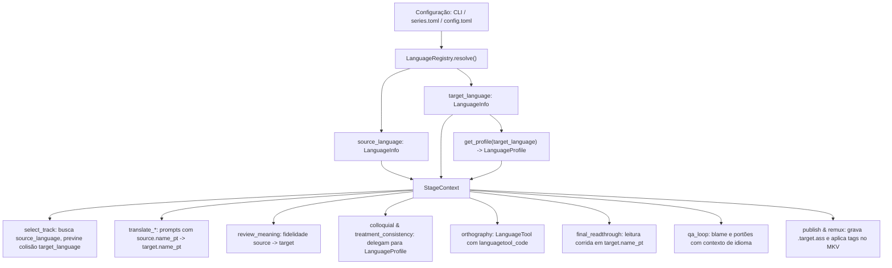

# M9 — Suporte Universal a Idiomas · Design

- **Marco:** M9 (subsistema 1 da v1.1, ver [`ROADMAP.md`](../../../ROADMAP.md))
- **Data:** 2026-10-04
- **Status:** Proposto para aprovação
- **Depende de:** v1.0.0 (M0 a M8 com 659 testes passando na `master`)
- **Branch:** `m9-suporte-universal-idiomas` (a partir de `master`)

---

## 1. Objetivo

Desacoplar o **TranslaterAny** da dependência estrita do par linguístico fixo (Inglês → Português do Brasil), tornando o pipeline capaz de traduzir e refinar legendas entre quaisquer idiomas de origem (`source_language`) e destino (`target_language`).

A entrega estabelece:
1. **Configuração e Precedência Flexível:** Idiomas configuráveis por linha de comando (`--source` / `--target`), por série (`series.toml`) e globalmente (`config.toml`), com defaults seguros `en` → `pt-BR`.
2. **Catálogo Canônico (`LanguageRegistry` e `LanguageInfo`):** Resolução universal de códigos IETF BCP-47, ISO 639-1, ISO 639-2 e aliases flexíveis, eliminando divergências entre metadados MKV, LanguageTool e nomes humanos nos prompts.
3. **Arquitetura Modular de Regras (`LanguageProfile`):** Desacoplamento de léxicos, checagens e heurísticas em perfis de idioma dedicados, entregando suporte completo à tríade inicial **Português (PT-BR)**, **Espanhol (ES)** e **Inglês (EN)**, além de um **`GenericProfile`** com resiliência total para qualquer idioma do mundo.
4. **Parametrização de Ponta a Ponta:** Injeção contextual dinâmica de idiomas na seleção de faixas (`select_track`), em todos os prompts das LLMs, no cliente do LanguageTool (`orthography`), na nomenclatura externa (`publish`) e nas propriedades de remux no container MKV.

---

## 2. Evidências e Motivação

| Cenário / Limitação na v1.0.0 | Solução arquitetural no M9 |
|---|---|
| Seleção de faixa (`select_track`) só busca faixas em inglês e rejeita qualquer faixa não-EN como `other_language` | `select_track` passa a buscar e priorizar a faixa de texto correspondente a `source_language` via `LanguageRegistry.matches` |
| Verificação de colisão só checa se já existe legenda PT-BR no MKV | Verifica se já existe faixa correspondente a `target_language` e informa o nome correto do idioma na mensagem |
| Prompts de todas as etapas de IA (`translate_dialogue`, `review_meaning`, `colloquial`, `treatment_consistency`, `final_readthrough`, `qa_loop`) possuem strings hardcoded como `"Inglês para Português do Brasil"` | Injeção dinâmica de `{source_language.name_pt}` e `{target_language.name_pt}` via `StageContext` |
| LanguageTool recebe fixo `language="pt-BR"` | `LanguageToolClient` recebe `target_language.languagetool_code` (ex.: `"es"`, `"en-US"`, `"pt-BR"`) |
| Regras gramaticais e léxicas (`checks/lexicon.py`, `treatment.py`, `triage.py`) eram acopladas exclusivamente ao português | Padrão `LanguageProfile` modulariza léxicos, consistência de tratamento e triagem coloquial por idioma |
| Arquivo gravado era fixo `<vídeo>.pt-BR.ass` e faixa embutida no remux tinha tag fixa `0:pt-BR` | Geração dinâmica de `<vídeo>.{target_language.code}.ass` e tags apropriadas no mkvmerge |

---

## 3. Fora do Escopo

| Item | Justificativa / Destino |
|---|---|
| Extração e OCR de legendas gráficas PGS (`.sup`) e VobSub (`.sub`/`.idx`) | Marco seguinte (M10 — OCR de Legendas Gráficas da v1.1) |
| Perfis gramaticais especializados para dezenas de outros idiomas além da tríade PT, ES e EN | O `GenericProfile` atende universalmente a todos os demais idiomas através de LanguageTool e LLM; novos perfis especializados (FR, DE, IT) podem ser criados sob demanda seguindo o mesmo padrão |
| Tradução com múltiplos idiomas alvo simultâneos numa única execução | Mantido o design limpo de um par (`source` → `target`) por comando de execução |

---

## 4. Decisões Acordadas

| # | Decisão | Justificativa |
|---|---|---|
| **D1** | **Precedência em 3 níveis: CLI > `series.toml` > `config.toml`** | Máxima flexibilidade operacional: permite definir padrão global em `config.toml`, especificar casos recorrentes da biblioteca em `series.toml` e sobrescrever pontualmente na CLI via `--source` / `--target`. |
| **D2** | **Catálogo Canônico `LanguageRegistry` e entidade `LanguageInfo`** | Compatibiliza BCP-47 (`pt-BR`, `en-US`), ISO 639-1 (`pt`, `es`, `en`, `ja`), ISO 639-2 (`por`, `spa`, `eng`, `jpn`) e aliases ("japonês", "ingles") sem ambiguidades e com tolerância total a variações. |
| **D3** | **Arquitetura de plugins `LanguageProfile` (Opção 1)** | Desacopla léxicos, checagens e heurísticas do núcleo do pipeline. Garante zero regressão para os 659 testes de PT-BR existentes e permite plugar novos idiomas sem tocar no código existente (OCP). |
| **D4** | **Tríade inicial completa: PT-BR, ES e EN** | PT-BR mantém 100% de paridade com v1.0.0; Espanhol traz consistência de *tú* vs *usted*, gênero (*el/la presidente*), negações e profanidades; Inglês traz consistência de pronomes (*he/she/they*), formalidade e negações. |
| **D5** | **`GenericProfile` como fallback universal sem falsos positivos** | Garante que o TranslaterAny processe qualquer idioma do mundo imediatamente, aplicando checagens neutras (timing, tags, marcadores `⟦n⟧`) e delegando gramática ao LanguageTool e prompt da LLM. |
| **D6** | **Parametrização via `StageContext`** | Todas as etapas acessam `context.source_language`, `context.target_language` e `context.target_profile`, evitando acoplamento direto com arquivos de configuração. |
| **D7** | **Nomenclatura dinâmica de arquivos `.ass` e metadados no MKV** | Nomenclatura `<stem>.{target_language.code}.ass` (ex.: `.es.ass`, `.pt-BR.ass`) e remux com `--language 0:{target_language.code}` e nome legível de faixa. |

---

## 5. Especificação dos Módulos

### 5.1 Pacote `translaterany.languages`

```
src/translaterany/languages/
├── __init__.py          # Exporta LanguageInfo, LanguageRegistry, get_profile, LanguageProfile
├── models.py            # Dataclass LanguageInfo e TreatmentReport
├── registry.py          # Catálogo e métodos de resolução/normalização
├── profile.py           # Protocol LanguageProfile e função de fábrica get_profile
└── profiles/
    ├── __init__.py
    ├── portuguese.py    # PortugueseProfile (PT-BR)
    ├── spanish.py       # SpanishProfile (ES)
    ├── english.py       # EnglishProfile (EN)
    └── generic.py       # GenericProfile (Fallback universal)
```

#### `LanguageInfo` (`models.py`)
```python
@dataclass(frozen=True)
class LanguageInfo:
    code: str              # Código canônico BCP-47 (ex: "pt-BR", "en", "es", "ja")
    iso639_1: str          # Código de 2 letras (ex: "pt", "en", "es", "ja")
    iso639_2: str          # Código de 3 letras p/ MKV (ex: "por", "eng", "spa", "jpn")
    name_pt: str           # Nome em português p/ prompts (ex: "português do Brasil", "japonês")
    name_en: str           # Nome em inglês (ex: "Brazilian Portuguese", "Japanese")
    name_native: str       # Nome nativo (ex: "Português", "日本語", "Español")
    languagetool_code: str # Tag para LanguageTool (ex: "pt-BR", "en-US", "es")
```

#### `LanguageRegistry` (`registry.py`)
- Catálogo pré-carregado com os principais idiomas de mídia e legendagem.
- Método `resolve(query: str) -> LanguageInfo`: Normaliza strings como `"pt_BR"`, `"pt-br"`, `"por"`, `"português"` para `LanguageInfo(code="pt-BR", ...)`.
- Se o código não estiver no catálogo (ex.: `"nl"` ou `"pl"`), instancia um `LanguageInfo` inferido seguro com fallbacks válidos.
- Método `matches(track_lang: str, target: LanguageInfo) -> bool`: Compara se a tag de idioma da faixa no MKV corresponde ao idioma alvo.

#### `LanguageProfile` (`profile.py`)
```python
class LanguageProfile(Protocol):
    info: LanguageInfo
    negation_pattern: re.Pattern
    profanity_pattern: re.Pattern
    function_words: frozenset[str]
    foreign_words_pattern: re.Pattern | None
    dialect_warnings_pattern: re.Pattern | None
    formal_connectives_pattern: re.Pattern | None
    archaic_pronouns_pattern: re.Pattern | None
    default_cps: float
    default_cpl: int

    def scan_treatment(
        self,
        lines_info: Sequence[dict[str, Any]],
        character_gender: Mapping[str, str],
    ) -> TreatmentReport: ...

    def colloquial_signals(
        self,
        lines: Sequence[LineInput],
        speaker_of: Mapping[str, str],
        speakers_with_style: set[str],
    ) -> dict[str, list[str]]: ...
```

#### Implementação dos Perfis
1. **`PortugueseProfile`:** Migra e encapsula `checks/lexicon.py` e `refine/treatment.py`, mantendo as expressões regulares de ênclise, conectivos formais de PT-BR, *você/tu/senhor* e artigos de cargos.
2. **`SpanishProfile`:** 
   - Negações: `\b(?:no|nunca|jamás|nadie|nada|ningún|ninguno|ninguna|tampoco)\b`.
   - Profanidades: `\b(?:mierda|joder|coño|puta|puto|cabrón|cabrona|gilipollas|pendejo|pendeja|hijo de puta|hostia)\b`.
   - Tratamento: análise de divergência de *tú* (formas *tienes*, *quieres*, etc.) vs. *usted* (*tiene*, *quiere*), e flexão de gênero (*el/la presidente*, *el/la testigo*, *el/la artista*).
   - Triagem Coloquial: conectivos como *no obstante*, *sin embargo*, *asimismo*, *por consiguiente*.
3. **`EnglishProfile`:**
   - Negações: `\b(?:not|never|no|nobody|nothing|none|neither|nor|without|nowhere|cannot)\b|n't\b`.
   - Profanidades: `\b(?:shit|fuck\w*|damn\w*|bitch\w*|bastard\w*|ass|asshole|crap)\b`.
   - Tratamento & Gênero: consistência de pronomes de terceira pessoa (*he/him/his* vs *she/her/hers* vs *they/them*) associados ao gênero cadastrado do personagem.
   - Triagem Coloquial: ausência de contrações em falas informais (*do not*, *cannot*) e conectivos arcaicos (*furthermore*, *moreover*, *henceforth*).
4. **`GenericProfile`:** Fornece padrões seguros sem disparar falsos positivos, delegando a correção ao LanguageTool e ao prompt da LLM.

---

### 5.2 Alterações nas Etapas Existentes

1. **`select_track`:**
   - Usa `context.source_language` para filtrar faixas candidatas.
   - Usa `context.target_language` para verificar colisão com legendas já existentes de terceiros.
2. **`translate_dialogue`, `translate_signs`, `translate_songs`:**
   - Interpola `{source_language.name_pt}` e `{target_language.name_pt}` no `SYSTEM_INSTRUCTIONS` e nos prompts.
3. **`review_meaning`:**
   - Parametriza a instrução de fidelidade com o par linguístico configurado.
4. **`colloquial` & `treatment_consistency`:**
   - Consultam `context.target_profile` para extrair sinais de triagem e relatórios de tratamento específicos do idioma alvo.
5. **`orthography`:**
   - Passa `context.target_language.languagetool_code` na requisição ao servidor LanguageTool.
6. **`final_readthrough`:**
   - Instrui a LLM a ler o fluxo corrido em `{target_language.name_pt}`.
7. **`qa_loop`:**
   - Exibe no feedback e nos blocos os códigos canônicos: `TEXTO ORIGINAL ({source_language.code}):` e `ÚLTIMA TRADUÇÃO VÁLIDA ({target_language.code}):`.
8. **`publish` & `remux`:**
   - Grava `<stem>.{target_language.code}.ass`.
   - Adiciona faixa no mkvmerge com `--language 0:{target_language.code}` e nome `"{target_language.name_pt} — TranslaterAny"`.

---

## 6. Fluxo de Dados e Interação



---

## 7. Estratégia de Testes (TDD)

1. **`tests/languages/test_registry.py`:**
   - Teste de resolução de mais de 20 variações de aliases e códigos BCP-47/ISO.
   - Teste de correspondência com faixas do MKV (`matches()`).
   - Teste de fallback gracioso para idiomas não cadastrados.
2. **`tests/languages/test_profiles.py`:**
   - Testes unitários para `PortugueseProfile`, validando 100% de paridade com as regras do M7/M8.
   - Testes unitários para `SpanishProfile`: detecção de tú vs. usted, gênero (*el/la presidente*), negações, profanidades e conectivos.
   - Testes unitários para `EnglishProfile`: consistência de pronomes, formalidade e negações.
   - Testes unitários para `GenericProfile`: ausência de quebras e comportamento seguro.
3. **`tests/stages/test_select_track_multilingual.py`:**
   - Validação da escolha de faixas em japonês, espanhol ou inglês conforme `source_language`.
   - Validação de detecção de colisão respeitando `target_language`.
4. **`tests/stages/test_prompts_multilingual.py`:**
   - Verificação textual exata da injeção de nomes de idiomas nos prompts para diferentes pares.
5. **`tests/pipeline/test_multilingual_e2e.py`:**
   - Teste sintético de ponta a ponta executando o pipeline para um episódio mockado no par `ja` → `es`, verificando geração de `.es.ass` e métricas consistentes.
   - Teste de hierarquia de configuração (CLI sobrescreve `series.toml`, que sobrescreve `config.toml`).

---

## 8. Critérios de Aceite

1. **100% de Compatibilidade Regressiva:** Os 659 testes existentes continuam passando na suíte de testes sem quebrar nenhum fluxo de trabalho estabelecido.
2. **Nova Cobertura de Testes:** Pelo menos 40 novos testes automatizados cobrindo o `LanguageRegistry`, os perfis de idioma (`PT`, `ES`, `EN`, `Generic`), seleção de faixas e injeção de prompts.
3. **Execução Multilíngue Validada:** Execução de pipeline sintético em pares alternativos (ex.: `ja` → `es` e `en` → `en`) concluída com sucesso do início ao fim.
4. **Verificação de Linter e Tipos:** `uv run ruff check` e `uv run ruff format --check` 100% limpos.
