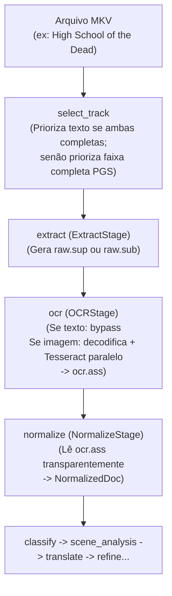

# Spec de Design — Marco M10: OCR para Legendas Gráficas (PGS / VobSub)

**Data:** 2026-10-05  
**Marco:** M10 (v1.1)  
**Status:** Aprovado  
**Branch sugerida:** `m10-ocr-legendas-graficas`  

---

## 1. Visão Geral e Objetivos

O Marco M10 expande a v1.1 do **TranslaterAny** com suporte completo e transparente a legendas gráficas baseadas em bitmaps:
- **Blu-ray PGS** (`S_HDMV/PGS`, arquivos `.sup`)
- **DVD VobSub** (`S_VOBSUB`, arquivos `.sub` + `.idx`)

O objetivo principal é permitir o processamento de mídias físicas de anime (como *High School of the Dead* e *Keijo!!!!!!!!* em `temporada-teste/`) convertendo os fluxos de imagem em texto com alta fidelidade temporal e geométrica, integrando-os de forma transparente ao pipeline existente de análise, tradução contextual e refinamento com IA.

### Critérios de Sucesso
1. **Seleção Inteligente:** `select_track` prioriza faixas completas de diálogo em relação a faixas parciais (Signs & Songs), selecionando a faixa PGS/VobSub completa quando não houver faixa de texto completa no idioma de origem.
2. **Decodificação Nativa Leve:** Parser embutido de pacotes PGS e VobSub utilizando apenas `Pillow` para binarização de alta precisão (sem dependências pesadas de OpenCV ou PyTorch).
3. **OCR Paralelizado via Tesseract:** Reconhecimento em lote multi-core com detecção de itálico (`{\i1}...{\i0}`) e inferência de posicionamento vertical (diálogo inferior `Default`, topo `{\an8}`, centro `{\an5}`).
4. **Desduplicação de Quadros:** Fusão de quadros consecutivos idênticos por hash de bitmap, economizando chamadas de OCR.
5. **Transparência no Pipeline:** Nova etapa `ocr` posicionada entre `extract` e `normalize`; faixas de texto nativas sofrem bypass instantâneo sem overhead; `normalize` consome o `.ass` gerado sem saber se a fonte original era texto ou imagem.
6. **Diagnóstico no `doctor`:** Checagem formal da presença do binário `tesseract` e dos pacotes de idiomas configurados.
7. **Qualidade e Cobertura:** Suíte de testes sintéticos cobrindo RLE, parsing, OCR e bypass; teste real validado nos animes da pasta `temporada-teste/`.

---

## 2. Arquitetura do Sistema



---

## 3. Especificação dos Componentes e Módulos

### 3.1. Seleção de Faixas Multimídia (`src/translaterany/media/tracks.py`)
A regra de ordenação dos candidatos do `select_track` passa a considerar:

$$\text{Prioridade} = (\text{is\_signs}(t), t.\text{codec\_id} \in \text{IMAGE\_CODECS}, \text{not } t.\text{default}, t.\text{id})$$

- **Regra 1:** Faixa completa (`is_signs=False`) SEMPRE precede faixa parcial (`is_signs=True`), mesmo que a parcial seja texto e a completa seja PGS.
- **Regra 2:** Em caso de empate na plenitude (ambas completas), texto (`IMAGE_CODECS=False`) tem preferência para evitar OCR desnecessário.
- **Regra 3:** Flag `default` do contêiner MKV.
- **Regra 4:** Menor ID numérico da faixa.
- **Regra 5:** Preferência explícita no `series.toml` (`preferred = "..."`) tem precedência absoluta.

### 3.2. Extração de Faixas Gráficas (`src/translaterany/media/extract.py` e `src/translaterany/stages/extract.py`)
- Para `S_HDMV/PGS`: `mkvextract` grava `<stem>.raw.sup`.
- Para `S_VOBSUB`: `mkvextract` grava `<stem>.raw.sub` (e `<stem>.raw.idx`).
- `ExtractArtifact` registra `format="sup"` ou `format="vobsub"`.

### 3.3. Estrutura Unificada de Quadros (`src/translaterany/media/ocr/models.py`)
```python
@dataclass(frozen=True)
class SubtitleDisplaySet:
    start_ms: int
    end_ms: int
    x: int
    y: int
    width: int
    height: int
    video_width: int
    video_height: int
    image: Image.Image  # Modo L (grayscale binarizado)
    forced: bool = False
```

### 3.4. Parser e Decodificador PGS (`src/translaterany/media/ocr/pgs.py`)
- Lê pacotes com cabeçalho PG (`0x50, 0x47`), relógio de 90 kHz.
- Interpretação dos segmentos:
  - **PCS (0x16):** Resolução da tela ($W \times H$), coordenadas $(X, Y)$ e estado de composição. Tempo inicial: $\text{pts} / 90$. PCS vazio fecha o tempo da legenda anterior.
  - **WDS (0x17):** Janela de visualização.
  - **PDS (0x14):** Paleta com canal Alpha.
  - **ODS (0x15):** Descompressão de RLE padrão Blu-ray para matriz 2D de índices de cor.
- **Binarização com Pillow:**
  - Aplica máscara binária: pixels com $\text{Alpha} > 64$ tornam-se pretos (`0`), fundo transparente torna-se branco (`255`).
  - Autocrop das margens vazias e adição de borda branca de 10px para facilitar detecção no Tesseract.

### 3.5. Parser e Decodificador VobSub (`src/translaterany/media/ocr/vobsub.py`)
- Leitura do `.idx` para mapeamento de timestamps e posições no arquivo `.sub`.
- Extração dos pacotes MPEG-2 subpicture do `.sub`.
- Descompressão RLE 2-bit DVD e geração do `SubtitleDisplaySet` idêntico ao PGS.

### 3.6. Motor de OCR e Paralelismo (`src/translaterany/media/ocr/engine.py`)
- **Tesseract Runner:**
  - Comando: `tesseract <temp.png> stdout --psm 6 --oem 1 -l <lang> hocr`
  - Idioma `-l`: mapeado do `source_language.iso639_2` (ex.: `eng`, `jpn`, `spa`).
  - Parsing do output hOCR: extrai texto limpo e detecta elementos `<em>`/`<i>` para marcar itálico.
- **Desduplicação:**
  - Calcula hash SHA-256 do bitmap binarizado.
  - Quadros consecutivos idênticos têm seus tempos fundidos (`prev.end_ms = curr.end_ms`) sem reexecutar o Tesseract.
- **Execução Concorrente:**
  - `ThreadPoolExecutor` com até 12 threads simultâneas em CPU.

### 3.7. Etapa `OCRStage` (`src/translaterany/stages/ocr.py`)
- **Escopo:** `StageScope.EPISODE`.
- **Inputs:** `("extract",)`.
- **Comportamento:**
  - Se a entrada for de texto (`.ass`, `.srt`):
    - Emite `OCRArtifact(bypassed=True, path=extract_path, sha256=file_sha256(extract_path), lines_count=0)`.
  - Se a entrada for gráfica (`.sup`, `.sub`):
    - Executa decodificação e OCR em paralelo.
    - Reconstrói o arquivo `<stem>.ocr.ass` com resolução (`PlayResX`, `PlayResY`), estilos (`Default`, `Top`, `Sign`) e inferência de posição vertical baseada em $Y$:
      - $Y < 0.25 \times V_H \rightarrow \text{Top} \text{ (ou tag } \verb|{\an8}|)$
      - $0.25 \times V_H \le Y \le 0.65 \times V_H \rightarrow \text{Sign} \text{ (ou tag } \verb|{\an5}|)$
      - $Y > 0.65 \times V_H \rightarrow \text{Default}$
    - Emite `OCRArtifact(bypassed=False, path=ocr_ass_path, sha256=..., lines_count=N, duration_ms=...)`.

### 3.8. Adaptação do `NormalizeStage` (`src/translaterany/stages/normalize.py`)
- No `bind_pipeline`:
  ```python
  if "ocr" in [s.name for s in previous]:
      self.source_stage = "ocr"
  else:
      self.source_stage = "extract"
  self.inputs = (self.source_stage,)
  ```
- O restante do pipeline continua sem nenhuma alteração.

### 3.9. Diagnóstico de Ambiente (`src/translaterany/util/doctor.py`)
- Nova função `check_tesseract_installed(source_lang: str | None = None) -> CheckResult`:
  - Confere se `tesseract` está no `PATH`.
  - Confere se o pacote de idioma necessário está listado em `tesseract --list-langs`.
  - Exibe instruções de instalação amigáveis caso ausente (`brew install tesseract tesseract-lang`).

---

## 4. Estratégia de Testes

1. **Testes Unitários de Parsing:**
   - `tests/media/ocr/test_pgs_parser.py`: valida parsing de PCS, WDS, PDS e decodificação RLE a partir de bytes sintéticos.
   - `tests/media/ocr/test_vobsub_parser.py`: valida leitura de `.idx` e `.sub` sintéticos.
2. **Testes de Integração de OCR:**
   - `tests/media/ocr/test_ocr_engine.py`: testa desduplicação de quadros, concorrência no `ThreadPoolExecutor` e extração de itálico via hOCR (usando mocks do Tesseract para execução ultrarrápida no CI).
3. **Testes da Etapa e Pipeline:**
   - `tests/stages/test_ocr_stage.py`: valida o bypass imediato quando a entrada é texto e a geração de `ocr.ass` quando a entrada é imagem.
   - `tests/stages/test_normalize_with_ocr.py`: valida que o `NormalizeStage` consome o `ocr.ass` e produz `NormalizedDoc` perfeitamente compatível com `ClassifyStage`.
4. **Testes Reais de Aceite (Fumaça):**
   - Execução com modelos locais nos primeiros episódios de *High School of the Dead* e *Keijo!!!!!!!!* em `temporada-teste/`.

---

## 5. Plano de Rollout e Verificação

1. Criar branch de desenvolvimento: `m10-ocr-legendas-graficas`.
2. Adicionar dependência `pillow` no `pyproject.toml` via `uv add pillow`.
3. Implementar módulos sob TDD estrito.
4. Validar regressão total (> 686 testes passando).
5. Executar os casos reais de teste em `temporada-teste/`.
6. Atualizar `STATE.md` e `ROADMAP.md`.
