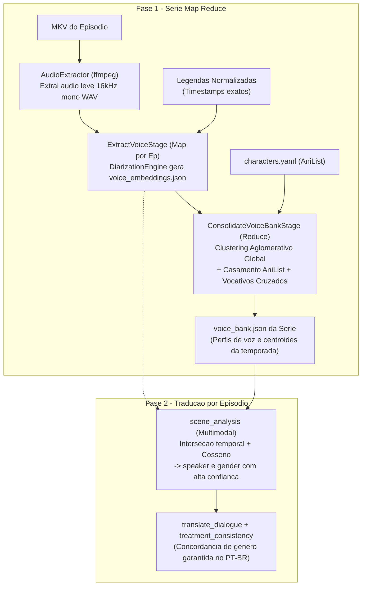

# Spec de Design — Marco M11: Diarização de Áudio e Multimodalidade (v1.2)

**Data:** 2026-10-06  
**Marco:** M11 (v1.2)  
**Status:** Aprovado  
**Branch sugerida:** `m11-diarizacao-audio`  

---

## 1. Visão Geral e Objetivos

O Marco M11 introduz a **v1.2** do **TranslaterAny**, expandindo o pipeline de tradução com **capacidades multimodais de áudio**. Ao cruzar os carimbos de tempo das legendas (texto ou OCR gráfico do M10) com a faixa de áudio vocal da mídia (`MKV`), o sistema elimina a principal causa de erros de tradução em japonês/inglês para PT-BR: **ambiguidade de gênero gramatical e falantes trocados em diálogos rápidos**.

### Objetivos Principais
1. **Diarização de Série Inteira (Map-Reduce):**
   - Agrupar e consolidar assinaturas de voz ao longo de toda a temporada (`voice_bank.json`), garantindo que a identidade vocal de cada personagem seja reconhecida desde o primeiro segundo do Episódio 1.
2. **Precisão de Falante e Gênero no `scene_analysis`:**
   - Casar intervalos de legendas com centróides acústicos, elevando a confiança de falantes para `high` e fornecendo gênero canônico/acústico garantido para as etapas [`translate_dialogue`](file:///home/fmoura-server/Documentos/Applications/TranslaterAny/src/translaterany/stages/translate_dialogue.py) e [`treatment_consistency`](file:///home/fmoura-server/Documentos/Applications/TranslaterAny/src/translaterany/stages/treatment_consistency.py).
3. **Arquitetura Plugável (`DiarizationEngine`):**
   - Motor padrão **100% aberto e local via ONNX** (sem cadastro, sem necessidade de Hugging Face token).
   - Suporte opcional a **PyAnnote 3.1** via configuração (`engine = "pyannote"`).
   - Se o `HF_TOKEN` estiver ausente, registrar aviso no log e realizar **fallback automático e gracioso** para o motor ONNX livre.
4. **Precedência Canônica e Salvaguardas Linguísticas:**
   - O gênero canônico da ficha do AniList (`CharacterEntry.gender`) tem precedência absoluta sobre o tom acústico (resolvendo garotos/shota dublados por mulheres adultas).
   - Regra estrita de vocativo: interpelar um nome identifica o **ouvinte (*listener*)**, nunca o falante daquela mesma fala.
5. **Tratamento Elegante de Personagens Desconhecidos (`Unknown`):**
   - Falantes sem nome registrado preservam gênero acústico (`Unknown (female)` / `Unknown (male)`) e consistência local na cena (`voice_cluster_X`), garantindo concordância gramatical feminina/masculina no PT-BR sem poluir o banco de vozes permanente da série.
6. **Resiliência Máxima:**
   - O pipeline nunca quebra por falhas de decodificação de áudio ou ausência de faixa compatível: executa fallback transparente para o modo textual legado (v1.1.1).
7. **Zero Regressão e Eficiência:**
   - Preservar 100% dos 727 testes passando; testes de áudio utilizam tensores sintéticos em memória para manter a suíte do `pytest` rápida (< 30s).

---

## 2. Arquitetura do Sistema



---

## 3. Especificação dos Componentes e Módulos

### 3.1. Módulo de Áudio (`src/translaterany/media/audio/`)

#### `engine.py` — Protocolo e Modelos de Diarização
```python
from dataclasses import dataclass
from pathlib import Path
from typing import Literal, Protocol

@dataclass(frozen=True)
class UnitTiming:
    unit_id: str
    start_ms: int
    end_ms: int

@dataclass(frozen=True)
class AcousticSegment:
    unit_id: str
    start_ms: int
    end_ms: int
    embedding: list[float]  # Vetor acústico de 192 ou 256 dimensões
    acoustic_gender: Literal["male", "female", "unknown"]
    has_speech: bool = True
    is_overlapped: bool = False

class DiarizationEngine(Protocol):
    def extract_embeddings(
        self,
        audio_path: Path,
        timings: list[UnitTiming],
    ) -> list[AcousticSegment]:
        """Extrai vetores acústicos e classificação de gênero para cada intervalo de fala."""
        ...
```

#### `onnx_engine.py` — Motor Livre ONNX (Padrão)
- Utiliza **Silero VAD** para detecção de atividade de voz e segmentação.
- Utiliza modelo pré-treinado em formato **ONNX** (ex.: Cam++ ou 3D-Speaker) para extração de embeddings de voz e inferência de tom/pitch.
- Execução local direta em GPU (via `onnxruntime-gpu`) com fallback automático para CPU (`onnxruntime`).
- Zero tokens e zero requisições externas.

#### `pyannote_engine.py` — Motor PyAnnote (Opcional)
- Instanciado quando `config.toml` contiver `[stages.extract_voice.options] engine = "pyannote"`.
- Lê a variável `HF_TOKEN` do ambiente ou `.env`.
- **Se `HF_TOKEN` não for fornecido:**
  - Registra: `logger.warning("HF_TOKEN ausente no ambiente. Fazendo fallback automático para OnnxAudioDiarizer.")`
  - Instancia e delega a execução transparentemente ao `OnnxAudioDiarizer`.

#### `extractor.py` — Extração de Áudio com `ffmpeg`
- Extrai a faixa de áudio vocal correspondente do MKV:
  ```bash
  ffmpeg -y -i <video.mkv> -map 0:a:<track_idx> -ac 1 -ar 16000 -vn -sn <temp_voice.wav>
  ```
- Gerencia o ciclo de vida do arquivo temporário via *context manager*, garantindo exclusão segura mesmo em caso de exceções.

---

### 3.2. Etapas no Pipeline (`src/translaterany/stages/`)

#### 1. `ExtractVoiceStage` (`src/translaterany/stages/extract_voice.py`)
- **Escopo:** `StageScope.EPISODE`
- **Entradas:** `normalize` (fornece os timestamps de diálogo) e inventário de mídia do episódio.
- **Processamento:**
  - Identifica a faixa de áudio no idioma correspondente (`source_language`).
  - Extrai áudio mono temporário.
  - Executa o `DiarizationEngine` para cada fala do episódio.
- **Artefato Gerado:** `voice_embeddings.json` por episódio:
  ```json
  {
    "episode_id": "S01E01",
    "segments": [
      {
        "unit_id": "u001",
        "start_ms": 12400,
        "end_ms": 14500,
        "embedding": [0.12, -0.45, ...],
        "acoustic_gender": "male",
        "has_speech": true
      }
    ]
  }
  ```

#### 2. `ConsolidateVoiceBankStage` (`src/translaterany/stages/consolidate_voice_bank.py`)
- **Escopo:** `StageScope.SERIES`
- **Entradas:** `extract_voice` (de todos os episódios disponíveis) e `metadata` (AniList).
- **Processamento:**
  - Coleta todos os segmentos acústicos de todos os episódios.
  - Executa **Clustering Aglomerativo Global** (com métrica de distância cosseno e limiar calibrado $\le 0.25$, i.e., similaridade cosseno $\ge 0.75$).
  - Calcula o **centróide médio** de cada cluster global.
  - **Mapeamento Canônico (AniList + Vocativos Cruzados):**
    - Vocativos no texto identificam o interlocutor (*listener*). Se uma fala interpela "Yuu", o falante é quem conversa com Yuu.
    - Aplica votação de consenso por frequência: se $> 70\%$ das âncoras identificadas para aquele cluster apontam para o mesmo personagem do AniList, o cluster é batizado.
    - O gênero do personagem em `characters.yaml` prevalece sobre o tom acústico.
  - **Filtro de Figurantes:** Clusters com menos de 3 aparições ou sem associação a personagens do AniList são descartados do banco permanente da série.
- **Artefato Gerado:** `voice_bank.json` (salvo na pasta de dados da série, no mesmo diretório de `characters.yaml`):
  ```json
  {
    "profiles": [
      {
        "character_name": "Yuu Otosaka",
        "canonical_gender": "male",
        "centroid": [0.11, -0.42, ...],
        "sample_count": 142,
        "confidence": "high"
      }
    ]
  }
  ```

#### 3. Integração Multimodal no `scene_analysis` (`src/translaterany/subtitles/scene_analysis.py`)
- O `scene_analysis` consome `voice_bank.json` e os embeddings do episódio.
- Para cada fala:
  - Calcula a similaridade cosseno entre o vetor da fala e os centróides do `voice_bank.json`.
  - Se $\text{similaridade} \ge 0.80$:
    - `speaker = profile.character_name`
    - `speaker_gender = profile.canonical_gender`
    - `confidence = "high"`
  - Se não houver casamento com personagem da série:
    - `speaker = "Unknown"`
    - `speaker_gender = segment.acoustic_gender`
    - `confidence = "medium"`
- Se houver divergência entre o vocativo textual estrito e o centróide de áudio, a salvaguarda de vocativo tem precedência e a confiança é moderada para `medium`.

---

## 4. Tratamento de Erros e Degradação Graciosa

| Cenário de Falha | Comportamento do Sistema |
| :--- | :--- |
| **`ffmpeg` ausente ou falha na extração de áudio** | Emite `WARNING [audio]` e gera `voice_embeddings.json` vazio (`segments=[]`). O pipeline continua via análise puramente textual. |
| **`HF_TOKEN` ausente quando `engine = "pyannote"`** | Emite `WARNING [audio]` e comuta automaticamente para o motor livre `OnnxAudioDiarizer`. |
| **MKV sem faixa de áudio compatível** | Ignora a extração acústica para o episódio, mantendo o fallback textual ativo sem lançar exceções. |
| **Segmento sem voz (silêncio / BGM / efeito sonoro)** | `has_speech = False`. A fala é ignorada pelo casamento de centróides e resolvida pelo contexto do LLM. |
| **Fala sobreposta de múltiplos personagens (*overlap*)** | `is_overlapped = True`. Confiança ajustada para `medium` para evitar poluir os centróides acústicos. |

---

## 5. Diagnóstico no Comando `translaterany doctor`

Novas checagens incorporadas ao `doctor`:
1. **Áudio `ffmpeg`:** valida se o `ffmpeg` possui suporte aos codecs `flac`, `aac`, `ac3`, `opus`.
2. **Motor de Diarização:** verifica a disponibilidade dos runtimes (`onnxruntime` / `torch`).
3. **Autenticação Hugging Face:** exibe status informativo (`HF_TOKEN` presente para PyAnnote ou ausente para uso do motor padrão ONNX).

---

## 6. Estratégia de Testes

### 6.1. Testes Unitários
- `tests/media/audio/test_audio_engine.py`: testa contratos da interface `DiarizationEngine`, inicialização e fallback de token.
- `tests/media/audio/test_audio_extractor.py`: testa geração de comandos `ffmpeg` e remoção do arquivo `.wav` temporário.
- `tests/stages/test_extract_voice_stage.py`: valida a geração de `voice_embeddings.json` com mocks rápidos de áudio.
- `tests/stages/test_consolidate_voice_bank.py`: valida agrupamento aglomerativo de múltiplos episódios e descarte de vozes efêmeras.
- `tests/test_multimodal_scene_analysis.py`: valida a fusão de evidências acústicas com âncoras de texto, vocativos e gênero AniList.

### 6.2. Testes de Regressão e E2E
- Executar a suíte completa com `uv run pytest`: confirmar que todos os 727 testes continuam passando.
- Teste sintético de pipeline E2E contendo `extract_voice` e `consolidate_voice_bank`.

---

## 7. Critérios de Conclusão ("Pronto Quando")

1. O comando `translaterany doctor` relata adequadamente o status do runtime de áudio e do token.
2. Episódios com áudio geram `voice_embeddings.json` e a consolidação da série gera `voice_bank.json` com perfis consolidados.
3. No `scene_analysis`, personagens recorrentes são identificados acusticamente com confiança `high`, garantindo concordância gramatical correta no PT-BR.
4. Falta de áudio ou falta de `HF_TOKEN` degrada graciosamente sem interromper a execução do pipeline.
5. Toda a suíte de testes automatizados passa com 100% de sucesso.
